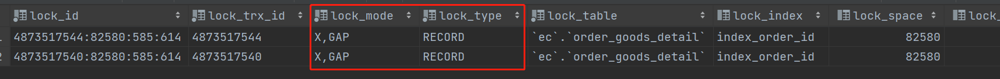

=== 标签

`事务` `Spring 事务传播机制` `MySQL` `死锁`

=== 出现的问题

=== 现象

接口层面：接口响应时间50s以上，日志文件抛出异常 单元测试：测试执行时间过长，控制台抛出异常

抛出的异常 Cause: java.sql.SQLException: Lock wait timeout exceeded; try restarting transaction

=== 产生的背景

被锁的表的表结构

----
create table order_goods_detail
(
    Id                       bigint auto_increment primary key,
    OrderId                  bigint                                 null comment '订单ID',
    IsDeleted                tinyint      default 0                 null comment '0:正常 1:删除',
    CreateSource             varchar(50)                            null comment '创建人',
    CreateTime               datetime     default CURRENT_TIMESTAMP null comment '创建时间',
    UpdateSource             varchar(50)                            null comment '修改人',
    UpdateTime               datetime     default CURRENT_TIMESTAMP null on update CURRENT_TIMESTAMP comment '修改时间'
)
    comment '订单商品明细表';
create index index_order_id
    on order_goods_detail (OrderId);
----

被调用的方法

----
public class OrderService {
    void save();
}

public class OrderGoodsDetailService {
    void insertWithRequiresNew();
}
----

----
@Service
public class OrderServiceImpl implements OrderService {
    @Override
    @Transactional(propagation = Propagation.REQUIRED)
    public void save(){
        orderGoodsDetailRepo.updateDeleteStatusByOrderId();
        orderGoodsDetailService.insertWithRequiresNew();
    }
}

@Service
public class OrderGoodsDetailServiceImpl implements OrderGoodsDetailService {
    @Override
    @Transactional(propagation = Propagation.REQUIRES_NEW)
    public void insertWithRequiresNew(){
        orderGoodsDetailRepo.insertOne();
    }
}
----

单元测试类

----
    @Test
    public void testTransaction() {
        orderService.save();
    }
----

=== 产生的原因

通过查看正在锁的事务语句查询

可以发现 order_goods_detail 表被加上了 X,GAP （X：，GAP： 间隙锁）

=== 解决方案
上述写法产生的背景：
在用户下完单之后，系统对订单分析，根据一系列规则对订单额外送出赠品，因为赠品要同订单同时发出，故在下单接口和修改订单接口进行处理。
而在修改订单接口的订单商品的原处理逻辑中为先逻辑删除修改前订单的商品，后重新插入修改后的订单商品。而额外的赠品插入要不影响原订单流程。
故想起用事务隔离进行处理，一开始想到的是用 `REQUIRES_NEW`，于是发现此种事务死锁情况。

可以采用 `NESTED` 传播机制进行解决。
